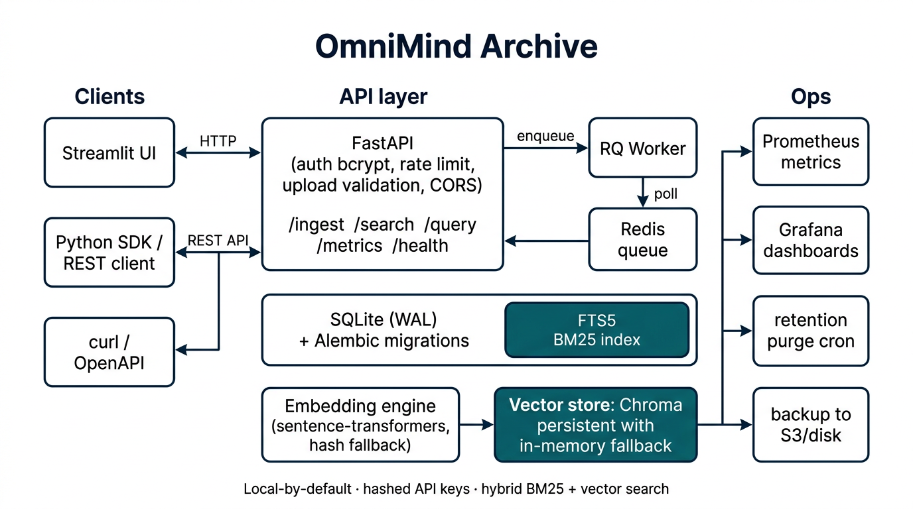

# OmniMind Archive

Privacy-first, local-by-default semantic search for chat export archives.



Hybrid **BM25 + vector** retrieval, hashed API keys, upload validation, Prometheus metrics, and a reproducible Alembic pipeline.

## Quick start (local)

```bash
python3.11 -m venv .venv
source .venv/bin/activate
pip install -r backend/requirements.txt
cp .env.example .env
# leave API_KEY empty and AUTH_REQUIRED=false for an open local UI
python backend/scripts/init_db.py

cd backend && PYTHONPATH=. uvicorn app.api:app --host 0.0.0.0 --port 8000 --reload
cd ui && streamlit run streamlit_app.py --server.port 8501 --server.address 0.0.0.0
```

Upload `samples/chatgpt_sample.json` (both consent boxes) then search `machine learning`.

Python SDK:

```python
from omnimind import OmniMindClient
OmniMindClient("http://127.0.0.1:8000", api_key="...").search("machine learning")
```

## Production deployment checklist

1. Set a strong `API_KEY` (hashed in memory) or `API_KEY_HASH`, and `AUTH_REQUIRED=true`.
2. Set `ALLOWED_ORIGINS` to your UI origin only (no `*`).
3. Set `ALLOW_INMEMORY_VECTORS=false` after installing `backend/requirements-ml.txt`.
4. Persist `DATA_DIR` (SQLite) and `CHROMA_PERSIST_DIR` on named volumes.
5. Run Redis + API + RQ worker (`QUEUE_BACKEND=rq`, `REDIS_URL=redis://redis:6379/0`).
6. Optionally set `SENTRY_DSN`.
7. Back up SQLite + Chroma on a schedule (`scripts/backup_db.sh`).
8. Expose `/health`, `/ready`, `/live`, `/metrics`; keep `/admin/*` behind the API key.
9. Enable retention only after a dry-run: `PURGE_ENABLED=true` + `scripts/purge_old_documents.py`.

Zero-downtime, backup/restore, and SQLite→Postgres notes: **[docs/ops.md](docs/ops.md)**.

## Environment variables

| Variable | Purpose |
|---|---|
| `API_KEY` | Bearer token (hashed at boot; never written to SQLite) |
| `API_KEY_HASH` | Optional precomputed bcrypt hash |
| `AUTH_REQUIRED` | Force auth even if `API_KEY` is empty |
| `ALLOWED_ORIGINS` | CORS allow-list |
| `DATA_DIR` | SQLite directory (`archive.db`) |
| `CHROMA_PERSIST_DIR` | Durable Chroma path |
| `ALLOW_INMEMORY_VECTORS` | Dev-only fallback when Chroma is missing |
| `REDIS_URL` | Redis for RQ + rate limits |
| `QUEUE_BACKEND` | `memory` (dev/CI) or `rq` |
| `RATE_LIMIT_*` | Ingest / search / query windows |
| `MAX_UPLOAD_SIZE_MB` | Upload cap (MIME sniffed) |
| `RETENTION_DAYS` / `PURGE_ENABLED` | Retention purge |
| `SENTRY_DSN` | Optional error reporting |

## Docker Compose (Redis + worker + volumes)

```bash
export API_KEY=changeme
docker compose up --build
```

This repo uses **RQ + Redis** (not Celery). Start the worker with `python -m app.worker` or the `worker` Compose service.

## Backups and restore

```bash
./scripts/backup_db.sh /var/backups/omnimind
./scripts/restore_db.sh /var/backups/omnimind/archive-$(date +%F).db /var/backups/omnimind/chroma-$(date +%F).tgz
```

Logical JSONL export/import:

```bash
PYTHONPATH=backend python backend/scripts/export_archive.py /tmp/archive.jsonl
PYTHONPATH=backend python backend/scripts/import_archive.py /tmp/archive.jsonl
```

## Tests and CI

```bash
cd backend
PYTHONPATH=. pytest tests/ -v --cov=app
ruff check app tests
```

CI definitions live in `docs/github-actions/` (copy to `.github/workflows/` if your token can write workflow files). They run ruff, mypy, pytest+coverage, Alembic, and a Docker build on Python 3.10–3.12. Benchmarks are a separate workflow.

Seed a deterministic test DB:

```bash
python scripts/seed_test_db.py
```

### Manual Chroma test

```bash
pip install -r backend/requirements-ml.txt
ALLOW_INMEMORY_VECTORS=false python -c "from app.embedder import ChromaVectorDB; print(ChromaVectorDB().backend)"
```

## Docs

| Doc | Contents |
|---|---|
| [docs/arch.md](docs/arch.md) | Architecture (mermaid + PNG) |
| [docs/api.md](docs/api.md) | API reference (OpenAPI) |
| [docs/migrations.md](docs/migrations.md) | Alembic upgrade / downgrade |
| [docs/ops.md](docs/ops.md) | Backup, restore, zero-downtime |
| [docs/monitoring.md](docs/monitoring.md) | Prometheus / Grafana / alerts |
| [docs/sdk.md](docs/sdk.md) | Python client + multi-user sessions |
| [docs/rag.md](docs/rag.md) | Retriever / LLM config |
| [docs/troubleshooting.md](docs/troubleshooting.md) | Common failures |
| [CONTRIBUTING.md](CONTRIBUTING.md) | PR + test conventions |

See `CHANGELOG.md` for breaking changes and rollback.
